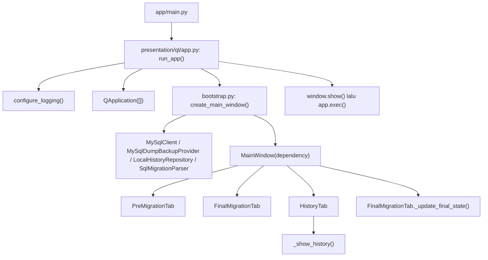
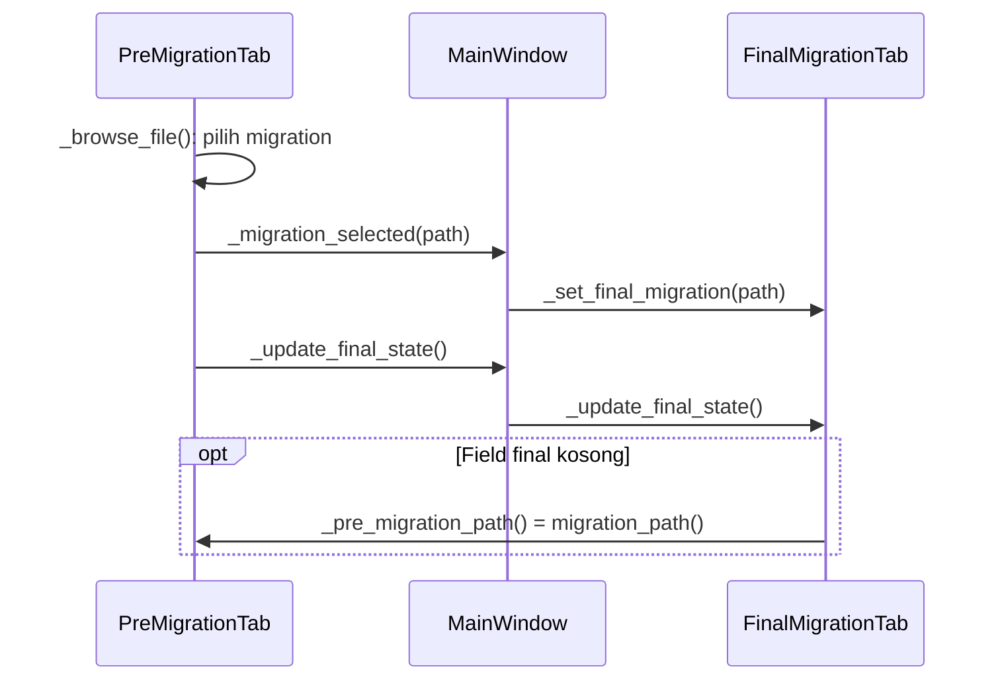

# Arsitektur dan Panduan Pengembangan Khanza Migrator

Diperbarui berdasarkan source repository pada **23 September 2026**. Semua path relatif terhadap root repository. Bagian 1–10 menjelaskan implementasi saat ini; bagian 11–13 panduan pengembangan; bagian 14 masalah yang masih ada; bagian 15–17 rekomendasi dan status roadmap.

Dokumen ini juga mencakup fitur resume Pre-Migration: editor SQL tersisa, checkpoint sukses, dan export migration_final.sql. Pengujian fitur menggunakan fake database serta Qt offscreen; tidak menjalankan MySQL atau migration pada database sungguhan.

## 1. Overview

Khanza Migrator menerima SQL migration dari luar, mengujinya pada database TEST, menyimpan approval, membuat backup PRODUCTION, lalu menjalankan migration final. Aplikasi tidak menghasilkan migration SQL dan tidak melakukan automatic rollback/restore ketika migration gagal.

Saat ini startup dan pembuatan dependency sudah dipisahkan dari UI. `MainWindow` mendaftarkan tiga class tab, meneruskan callback antar-tab, dan masih mengelola QThread/worker. Widget, handler, dan state migration berada di masing-masing tab. Adapter teknis masih berada di `app/shared/`.

Urutan baca untuk belajar codebase:

1. `app/main.py` → `app/presentation/qt/app.py:run_app()`.
2. `app/bootstrap.py:create_main_window()` → `app/presentation/qt/migration/main_window.py:MainWindow.__init__()`.
3. `app/presentation/qt/migration/pre_migration_tab.py:PreMigrationTab._run_pre()` → callback `MainWindow._run_worker()`.
4. `app/presentation/qt/migration/workers.py:Worker.run()` → `app/domains/migration/application/resumable_pre_migration.py:ResumablePreMigration.run()` untuk Pre; runner production tetap `RunMigrationUseCase.execute()`.
5. `app/domains/migration/application/ports.py`, model domain, lalu adapter di `app/shared/`.

Tidak ada dependency injection framework, registry tab, `TaskRunner`, custom `QDialog`, atau class `MigrationService`. Orchestration aplikasi memakai class `*UseCase` dengan method `execute()`.

## 2. Application Entry Point

| Jalur | File/simbol | Perilaku |
| --- | --- | --- |
| GUI: `python -m app.main` | `app/main.py`, blok `__main__` | Memanggil `run_app()` dari `app/presentation/qt/app.py` |
| CLI: `python -m app.cli` | `app/cli.py:main()` | Subcommand `hash` dan `parse`; keluar melalui `SystemExit(main())` |
| CLI setelah instalasi | `pyproject.toml:[project.scripts]` | `khanza-migrator = "app.cli:main"`; bukan launcher GUI |

CLI langsung menggunakan `app/shared/hashing/sha256.py:sha256_file()` atau `app/shared/sql/parser.py:SqlMigrationParser.parse_file()`. CLI belum menyediakan workflow reset, approval, backup, atau eksekusi migration.

`pyproject.toml` adalah sumber acuan instalasi:

- Minimum Python `>=3.10`. Source menggunakan union type `X | None`; tidak ditemukan kebutuhan khusus Python 3.11. Verifikasi Tahap 2 berhasil pada Python 3.10.12 dengan dependency yang kompatibel.
- Runtime: `PySide6>=6.7,<7` dan `python-dotenv>=1.2,<2`. `app/config.py` mengimpor `dotenv.load_dotenv`.
- Development/test: extra `dev` berisi `pytest>=9,<10`.
- `requirements.txt` berisi referensi package lokal `.`. Dari root repository, `python -m pip install -r requirements.txt` setara dengan `python -m pip install .`.
- Development: `python -m pip install -e '.[dev]'`; test: `python -m pytest -q`.
- Operasi database memerlukan executable `mysql` dan `mysqldump`. Tidak ditemukan ORM atau driver koneksi MySQL Python.

## 3. Startup Flow

1. `app/main.py` mengimpor `app/presentation/qt/app.py:run_app()`.
2. Import berlanjut melalui bootstrap, `MainWindow`, dan module tab. Module tab mengimpor `app/config.py`, yang memanggil `load_dotenv(BASE_DIR / ".env")` dan membentuk konstanta `PRE_*`/`FINAL_*` melalui `env()` dan `env_int()`. Port invalid dapat gagal saat import.
3. `run_app()` memanggil `app/shared/logging/logger.py:configure_logging()`, membuat log di `~/.khanza-migrator/logs/application.log`.
4. `run_app()` membuat `QApplication([])`, baru memanggil `app/bootstrap.py:create_main_window()`.
5. Bootstrap membuat satu `MySqlClient`, `MySqlDumpBackupProvider`, `LocalHistoryRepository`, dan `SqlMigrationParser`, lalu mengirimkannya sebagai argument constructor `MainWindow`.
6. `LocalHistoryRepository.__init__()` membuat direktori history bila belum ada. `MainWindow.__init__()` menyimpan dependency, menghubungkan progress signal, dan menginisialisasi `_active_threads`.
7. `MainWindow` membuat `PreMigrationTab`, `FinalMigrationTab`, dan `HistoryTab` secara eager, lalu mendaftarkannya ke `QTabWidget`. History langsung dimuat oleh `HistoryTab.__init__()`.
8. Setelah `setCentralWidget()`, `MainWindow._update_final_state()` meneruskan panggilan ke `FinalMigrationTab._update_final_state()`. Method ini membaca approval/hash dan menonaktifkan tombol eksekusi final.
9. `run_app()` memanggil `window.show()` lalu `app.exec()`.



`run_app()` tidak lagi berada di `main_window.py`. `MainWindow()` tanpa dependency bukan cara konstruksi existing; gunakan bootstrap setelah `QApplication` tersedia. Bootstrap juga membuat `ResumablePreMigration(parser, db, history, LocalSessionRepository())`, menginjeksi MainWindow lalu PreMigrationTab. Use case production/reset/approval masih dibuat oleh handler tab saat diperlukan.

## 4. Project Directory Structure

Struktur source saat ini; file `__init__.py` tidak ditampilkan:

```text
app/
├── main.py
├── cli.py
├── bootstrap.py
├── config.py
├── domains/migration/
│   ├── domain/
│   │   ├── enums.py
│   │   ├── models.py
│   │   └── session.py
│   └── application/
│       ├── ports.py
│       ├── use_cases.py
│       ├── resumable_pre_migration.py
│       └── session_ports.py
├── presentation/qt/
│   ├── app.py
│   └── migration/
│       ├── main_window.py
│       ├── pre_migration_tab.py
│       ├── final_migration_tab.py
│       ├── history_tab.py
│       └── workers.py
└── shared/
    ├── database/
    │   ├── mysql_client.py
    │   └── backup.py
    ├── filesystem/
    │   ├── history.py
    │   └── sessions.py
    ├── hashing/sha256.py
    ├── logging/logger.py
    └── sql/
        ├── parser.py
        └── render.py
tests/
├── conftest.py
├── test_hash.py
├── test_parser.py
├── test_safety.py
├── test_migration_use_cases.py
├── test_history_repository.py
├── test_resumable_pre_migration.py
└── test_pre_migration_resume_ui.py
docs/ARCHITECTURE.md
pyproject.toml
requirements.txt
README.md
AGENTS.md
.env.example
```

`app/application/`, `app/infrastructure/`, `app/domains/migration/infrastructure/`, `presentation/qt/workers/`, dan subfolder `tabs/` belum ada. Ketiga class tab berada langsung di `app/presentation/qt/migration/`. Pedoman AGENTS dan struktur usulan bukan bukti bahwa directory tersebut sudah diimplementasikan.

## 5. Layer Responsibilities

| Area | Komponen | Tanggung jawab |
| --- | --- | --- |
| `app/bootstrap.py` | `create_main_window()` | Composition root: membuat adapter konkret dan menginjeksi window |
| `app/presentation/qt/app.py` | `run_app()` | Logging startup, QApplication, show, event loop |
| `app/presentation/qt/migration/main_window.py` | `MainWindow` | Registrasi tab, penghubung Pre → Final, ownership worker/thread |
| `app/presentation/qt/migration/*_tab.py` | `PreMigrationTab`, `FinalMigrationTab`, `HistoryTab` | Form, dialog, handler, state dan rendering milik tab |
| `app/domains/migration/application/use_cases.py` | Enam class `*UseCase` | Workflow dan validasi prasyarat, tanpa Qt |
| `app/domains/migration/application/ports.py` | `DatabasePort`, `BackupPort`, `HistoryPort`, `MigrationParserPort` | Kontrak `typing.Protocol`, dipenuhi adapter secara struktural |
| `app/domains/migration/domain/` | Dataclass dan enum | Data migration, hasil, approval, backup, safety report; tanpa PySide6 |
| `app/shared/` | Adapter database/parser/history, hash/logging | Implementasi I/O dan utilitas teknis |
| `app/config.py` | `env()`, `env_int()`, konstanta | Default form dari environment/.env |

`MainWindow` menerima database/backup/parser bertipe port, tetapi history bertipe `LocalHistoryRepository`. `HistoryTab` membutuhkan `root` dan `approval_file` yang tidak tercantum di `HistoryPort`; Pre/Final menerima `HistoryPort`. Instance repository yang sama diteruskan ke semua tab.

`shared` belum sepenuhnya generik: adapter mengimpor model migration, dan `MySqlClient` menggunakan `ProgressCallback` dari application port. Use case juga langsung menggunakan helper `sha256_file()`.

## 6. UI Architecture

`MainWindow` tidak lagi memiliki field `pre_*`, `final_*`, `history_text`, `last_pre_result`, atau `last_backup`. Kepemilikannya:

| Komponen dan path | State/widget utama | Method utama |
| --- | --- | --- |
| `pre_migration_tab.py:PreMigrationTab` | `pre_*`, `session`, `completed_sql`, `pending_sql`, `output_path`, `last_pre_result` | `_build_ui()`, `_pre_config()`, `_run_pre()`, `_approve()`, `migration_path()` |
| `final_migration_tab.py:FinalMigrationTab` | `final_*`, `safety_labels`, `last_backup` | `_build_ui()`, `_final_config()`, `_validate_final()`, `_create_backup()`, `_execute_final()` |
| `history_tab.py:HistoryTab` | `history_text`, repository | `_show_history()`, `_reset_all_data()` |
| `main_window.py:MainWindow` | `tabs`, `pre_tab`, `final_tab`, `_active_threads`, dependency bersama | `_set_final_migration()`, `_update_final_state()`, `_run_worker()` |

Semua path pada tabel berada di `app/presentation/qt/migration/`. Widget dibangun langsung dengan Python/layout Qt; tidak ada Qt Designer `.ui` atau custom dialog class pada struktur ini.

Komunikasi Pre → Final menggunakan callback biasa, bukan event bus:

| Callback constructor | Nilai yang diinjeksi oleh `MainWindow` | Efek |
| --- | --- | --- |
| Pre `migration_selected` | `MainWindow._set_final_migration` | Meneruskan path ke `FinalMigrationTab._set_final_migration()` |
| Pre `update_final_state` | `MainWindow._update_final_state` | Meneruskan ke `FinalMigrationTab._update_final_state()` |
| Final `pre_migration_path` | `PreMigrationTab.migration_path` | Fallback path ketika field final kosong saat pembaruan status |
| Pre/Final `run_worker` | `MainWindow._run_worker` | Dispatch background function dengan widget log/progress dan callback hasil |



Pemilihan migration lewat Browse menyalin path ke Final. Browse backup hanya meminta pembaruan status. Edit path manual tidak melakukan sinkronisasi otomatis; tidak ada `textChanged` yang menginvalidasi backup. `FinalMigrationTab` tetap dibuat dengan field migration kosong meskipun konfigurasi PRE memiliki path awal.

Approval tersimpan pada repository bersama. `_approve()` meminta update final setelah penyimpanan berhasil. Callback aktif Pre sekarang `_session_finished()`. Setelah seluruh SQL sukses, callback menampilkan output dan mengirim path `migration_final.sql` ke Final. Handler hasil pre lama telah diganti oleh alur sesi ini. Approval membaca file output dan metadata target/backup sesi, bukan file input awal.

## 7. Tab Lifecycle

Registrasi dilakukan eksplisit di `app/presentation/qt/migration/main_window.py:MainWindow.__init__()`:

1. Buat `self.pre_tab = PreMigrationTab(...)`; `addTab(self.pre_tab, "Pre-Migration")`.
2. Buat `self.final_tab = FinalMigrationTab(...)`; `addTab(self.final_tab, "Final Migration")`.
3. `addTab(HistoryTab(self.history), "History")`.

Pre/Final menyusun layout melalui `_build_ui()` yang dipanggil constructor. History menyusun layout langsung di `__init__()` dan memanggil `_show_history()`. Urutan ini membuat callback `pre_migration_path` tersedia saat Final dibuat; callback Pre yang meneruskan ke Final baru digunakan setelah konstruksi selesai.

Tidak ada lazy loading, registry, `currentChanged`, atau hook saat tab dibuka. Berpindah tab tidak membuat ulang widget atau otomatis merefresh history. Qt mengelola page melalui widget tree. `MainWindow.closeEvent()` menolak penutupan saat `_active_threads` tidak kosong. Run/resume/reset Pre juga menonaktifkan window selama operasi; mekanisme cancellation belum ada.

`HistoryTab._show_history()` membaca `root.rglob("result.json")`, mengurutkan path secara menurun, dan membatasi ke 100 file sebelum parsing. Setiap file menampilkan path, lalu ringkasan:

```text
  SUCCESS | nama_database | success=3 failed=0
```

File JSON invalid atau field tidak lengkap tetap menyumbang baris path; exception parsing/formatting diabaikan. Jika tidak ada file: `Belum ada execution history.` Refresh dilakukan saat konstruksi, saat tombol Refresh diklik, dan setelah penghapusan data lokal berhasil.

`HistoryTab._reset_all_data()` terhubung ke tombol **Hapus Semua Data**. Setelah konfirmasi Yes (default No), method menghapus isi `history.root`, isi `~/khanza-migrator-backups`, dan `history.approval_file`, kemudian merefresh History dan menampilkan hasil. Operasi memakai `shutil.rmtree()`/`Path.unlink()` langsung di UI; tidak memanggil MySQL. Folder root, log aplikasi, folder sesi resume (`~/.khanza-migrator/sessions`), dan backup yang disimpan di luar folder default tersebut tidak ikut dibersihkan oleh method ini. Belum ada callback ke Pre/Final untuk mereset state in-memory setelah penghapusan.

## 8. Dialog Lifecycle

Dialog existing berupa pemanggilan statis Qt; belum ada subclass `QDialog`. Parent dialog normal adalah tab yang memanggilnya, sedangkan error worker masih memakai parent `MainWindow`.

| Pemanggil | Dialog dan alur |
| --- | --- |
| `PreMigrationTab._browse_file()`, `FinalMigrationTab._browse_file()` | `QFileDialog.getOpenFileName()`; path kosong berarti batal |
| `PreMigrationTab._test_pre_connection()` | Warning input, question membuat database TEST bila belum ada, critical jika gagal |
| `PreMigrationTab._reset_test()` | Warning Yes/No default No; Yes melanjutkan dispatch reset |
| `PreMigrationTab._run_pre()`, `_approve()` | Warning prasyarat; approval juga information/critical |
| `FinalMigrationTab._validate_final()` | Critical jika exception; mengembalikan False |
| `FinalMigrationTab._create_backup()` | Warning prasyarat, `getSaveFileName()`, question overwrite bila file sudah ada |
| `FinalMigrationTab._execute_final()` | Pre-flight lalu warning konfirmasi PRODUCTION; default No |
| `FinalMigrationTab._final_finished()` | Information sukses atau critical gagal tanpa automatic restore |
| `HistoryTab._reset_all_data()` | Warning penghapusan lokal, information berhasil, critical exception |
| `MainWindow._run_worker()` | `worker.failed` → lambda → `QMessageBox.critical()` |

Password bukan dialog tersendiri: Pre/Final memakai `QLineEdit` dengan echo mode Password dan default dari konfigurasi. Handler membaca nilai input lalu mengarahkan operasi ke use case/adapter.

## 9. Application / Service Flow

Use case existing berada di `app/domains/migration/application/use_cases.py`; alur resume Pre berada di `resumable_pre_migration.py`. Bootstrap membuat adapter dan service resume; tab masih membuat use case reset/approval/production sesuai aksi pengguna.

| Use case | Dependency constructor | Alur `execute()` |
| --- | --- | --- |
| `ResetTestDatabaseUseCase` | `DatabasePort` | Wajib TEST, backup ada → connection → exists/drop → create → import → verify |
| `RunMigrationUseCase` | Parser, database, history port | Hash/parse file → execute berurutan → stop pada error pertama → simpan hasil |
| `ApproveMigrationUseCase` | `HistoryPort` | Wajib status SUCCESS dan hash sama → bentuk/simpan `Approval` |
| `ValidateFinalMigrationUseCase` | Database/history port | File, approval/hash, count pre, environment, connection, metadata backup → `SafetyReport` |
| `CreateProductionBackupUseCase` | `BackupPort` | Wajib PRODUCTION → hash migration → create backup → verify backup |
| `RunFinalMigrationUseCase` | Runner dan validator use case | Validasi ulang → blokir bila gagal → delegasi runner |

### Resume Pre-Migration

`app/domains/migration/domain/session.py:PreMigrationSession` menyimpan target TEST,
source/backup, SQL pending, hasil sukses, error terakhir, dan status in-flight.
`app/domains/migration/application/resumable_pre_migration.py:ResumablePreMigration`
menyediakan `start()`, `run()`, `invalidate()`, dan `result()`. Port session berada
pada `application/session_ports.py`; adapter `app/shared/filesystem/sessions.py:LocalSessionRepository`
menyimpan JSON secara atomic replace di `~/.khanza-migrator/sessions/<id>/`.
Password tidak disimpan. Resume UI hanya tersedia selama aplikasi terbuka; belum
ada aksi membuka sesi lama setelah restart.

`run()` menandai in-flight sebelum SQL, menyimpan successful prefix setiap selesai,
dan berhenti pada error pertama. Editor hanya mengganti pending tail; prefix tidak
ikut dieksekusi ulang. Target berbeda, sesi invalidated, atau status in-flight yang
tidak pasti ditolak. Reset TEST menginvalidasi sesi sebelum operasi reset.

Setelah semua SQL berhasil, `app/shared/sql/render.py:render_statements()` membentuk
`migration_final.sql` dengan delimiter yang tidak bertabrakan. Parser existing
memeriksa round-trip statement; hasil agregat SUCCESS dan hash output dipakai oleh
approval existing. Kegagalan export dapat dicoba lagi tanpa mengulang SQL sukses.
File input asli tidak ditimpa. Checkpoint adalah catatan operasi, bukan bukti
bahwa database tidak diubah oleh proses lain. SQL gagal dapat memiliki efek parsial;
uji ulang output dari backup diperlukan untuk memastikan reproduksibilitas sebelum production.

Alur pre-migration:

```mermaid
sequenceDiagram
    participant P as PreMigrationTab
    participant M as MainWindow
    participant W as Worker
    participant U as ResumablePreMigration
    participant D as MySqlClient
    participant H as LocalHistoryRepository
    P->>P: _run_pre(): snapshot input dan editor SQL
    P->>M: _run_worker(function, log, progress, callback)
    M->>W: QThread.started → run()
    W->>U: start/load sesi lalu run(..., progress.emit)
    U->>U: parse pending; simpan checkpoint
    loop SQL pending sampai selesai atau error pertama
        U->>D: execute(config, password, sql)
        U-->>W: progress
        W-->>M: worker_progress → _handle_worker_progress
    end
    U->>H: save_execution(attempt atau hasil agregat)
    U-->>W: PreMigrationSession
    W-->>P: succeeded → _session_finished()
    W-->>M: finished → quit / cleanup
```

`Worker.succeeded` berarti function kembali normal, bukan semua SQL berhasil. Exception per statement ditangkap runner menjadi hasil FAILED; callback harus memeriksa `result.status`. Pada runner production, error di luar blok statement mencapai `Worker.failed`. Pada Pre, wrapper operasi mengembalikan pasangan sesi/error agar `_session_finished()` tetap dapat menampilkan checkpoint sukses saat terjadi error parsing/history.

`app/presentation/qt/migration/workers.py:Worker.run()` memanggil callable dengan `self.progress.emit`, mengirim succeeded/failed, dan selalu mengirim finished. `MainWindow._run_worker()` membuat QThread, menyimpan pasangan di `_active_threads`, menghubungkan progress melalui signal milik MainWindow, serta memasang quit/deleteLater/cleanup. Backup Final mengirim tombol backup sebagai `busy_button`; run/resume/reset Pre mengirim window agar interaksi terkunci selama pekerjaan. Operasi Final lain belum memiliki guard menyeluruh.

Reset, pre-run, backup, dan final-run memakai worker. Test connection langsung menggunakan adapter dari `PreMigrationTab._test_pre_connection()`. Pre-flight, approval/hash, history read, dan penghapusan lokal masih sinkron di GUI. Lambda pada `FinalMigrationTab._execute_final()` masih membaca widget saat function worker dijalankan; ekstraksi tab belum memperbaikinya.

Adapter dan persistence:

- `app/shared/sql/parser.py:SqlMigrationParser.parse_file()` membaca UTF-8 BOM, lalu `parse()` memecah statement dengan quote/comment/DELIMITER dasar. `_detect_type()` dan `_description()` membuat klasifikasi/deskripsi; bukan semantic SQL parser.
- `app/shared/database/mysql_client.py:MySqlClient.execute()` membuat proses `mysql --execute` baru per statement. State session SQL tidak dijamin bertahan antarstatement. `import_sql()` memasukkan file ke stdin satu proses dan menunggu selesai; progress mulai/selesai. `verify_database()` memeriksa koneksi dan jumlah tabel lebih dari nol.
- `app/shared/database/backup.py:MySqlDumpBackupProvider.create_backup()` menggunakan mysqldump dengan routines/triggers/events dan `--databases`. `verify_backup()` memeriksa file/ukuran/SHA-256, bukan uji restore. Password dikirim melalui environment child process `MYSQL_PWD`.
- `app/shared/filesystem/history.py:LocalHistoryRepository.save_execution()` menulis `migration.sql`, `result.json`, dan `metadata.json` ke `~/.khanza-migrator/history/<tahun>/<bulan>/migration_<timestamp>/`. `save_approval()` menyimpan satu `~/.khanza-migrator/approval.json`; `load_approval()` mengembalikan dataclass.
- `save_execution()` menerima backup opsional, tetapi runner tidak mengirimkannya, termasuk alur final. Akibatnya metadata execution dari alur itu berisi `backup: null`.

## 10. Domain Layer

`app/domains/migration/domain/models.py` berisi:

| Model | Tanggung jawab |
| --- | --- |
| `DatabaseConfig` | Host, port, database, username, environment; password terpisah |
| `MigrationStatement` | Urutan, SQL, tipe, deskripsi |
| `StatementResult` | Keberhasilan, durasi, SQL, error satu statement |
| `MigrationExecutionResult` | Status/hash/database/waktu/hasil; property `success_count`, `failed_count`, `failed_statement` |
| `Approval` | Hash/nama migration, informasi test, count, waktu dan versi |
| `BackupMetadata` | Target, file, ukuran/hash backup, hash migration, waktu dan versi |
| `SafetyCheck` | Nama, hasil boolean, detail |
| `SafetyReport` | List check; property `passed` memakai `all()` |

`app/domains/migration/domain/enums.py` mendefinisikan `Environment`, `MigrationStatus`, dan `StatementType`. Domain tidak mengimpor PySide6. Model sebagian besar pembawa data; aturan workflow berada pada use case. Tidak ada state machine: hasil execution aktual SUCCESS/FAILED, sedangkan teks FINAL MIGRATION COMPLETED di UI tidak mengubah enum hasil menjadi COMPLETED.

## 11. How to Add a New Tab

Contoh berikut adalah panduan, bukan class yang sudah ada:

1. Buat `app/presentation/qt/migration/inspection_tab.py:InspectionTab(QWidget)`. Constructor menerima dependency/callback yang diperlukan dan membangun layout, mengikuti tab existing.
2. Daftarkan instance melalui `MainWindow.__init__():self.tabs.addTab(...)` di `main_window.py`. Tidak perlu registry atau base-tab framework.
3. Jika perlu adapter baru, buat wiring konkret pada `app/bootstrap.py:create_main_window()` lalu teruskan dependency melalui constructor MainWindow ke tab.
4. Hubungkan tombol ke handler tab, misalnya `_inspect()`. Operasi lama memakai callback `run_worker` dari MainWindow, dengan hasil diarahkan ke method tab.
5. Gunakan callback data terfokus untuk hubungan antar-tab, seperti `migration_path()` existing. Jangan mengirim seluruh MainWindow agar tab dapat mengambil semua widget/state.
6. Ambil nilai widget sebelum menjalankan function worker untuk fitur baru. Pola final existing yang belum aman bukan pola yang perlu disalin.

Tab presentasi murni tidak memerlukan domain/use case baru. Tab existing berada langsung di folder `migration/`; tidak perlu memindahkannya ke folder `tabs/` untuk menambah satu fitur.

## 12. How to Add a New Dialog

Konfirmasi sederhana tetap dapat memakai `QMessageBox` pada handler tab. Untuk form kompleks, contoh usulan:

1. Buat `app/presentation/qt/migration/dialogs/connection_dialog.py:ConnectionDialog(QDialog)` beserta package bila diperlukan.
2. `__init__()` menyusun input; OK/Cancel mengarah ke `accept()`/`reject()`. Validasi input dilakukan sebelum accept.
3. Method seperti `database_config() -> DatabaseConfig` mengembalikan data biasa; password tetap terpisah.
4. Handler pemanggil pada Pre/Final membuat dialog dengan parent tab, menjalankan `exec()`, memeriksa Accepted, lalu mengambil data untuk use case/worker.
5. Dialog tidak memasukkan Qt ke application/domain. Operasi panjang tidak dijalankan sinkron hanya karena berada di dialog.

Path/class ini belum ada. Dialog baru hanya diperlukan jika kompleksitas form membutuhkannya; jangan membungkus semua message box dalam class baru.

## 13. How to Add a New Feature

Contoh preview SQL tanpa eksekusi:

| Kebutuhan | Lokasi usulan | Hubungan |
| --- | --- | --- |
| Orchestration | `app/domains/migration/application/preview_migration.py:PreviewMigrationUseCase.execute(path)` | Memakai `MigrationParserPort.parse_file()` → `list[MigrationStatement]` |
| Presentasi | Handler pada `PreMigrationTab` atau tab/dialog baru | Input path → worker/use case → tampilkan hasil |
| Wiring | `app/bootstrap.py:create_main_window()` jika ada dependency baru | Adapter → constructor MainWindow → tab |
| Test | `tests/test_preview_migration.py` | Fake parser, tanpa Qt/MySQL untuk use case |

Gunakan model dan port existing bila cukup. Aturan murni dapat menjadi function domain; orchestration I/O berada di application. Tambahkan port hanya untuk kemampuan eksternal yang belum ada, lalu adapter di lokasi existing `app/shared/`. Pemindahan adapter ke infrastructure merupakan pekerjaan terpisah.

Callback progress existing adalah `ProgressCallback = Callable[[str, int, int], None]` di `application/ports.py`. Application tidak perlu mengenal Qt signal. Buat domain baru hanya jika konsep bisnisnya berbeda, bukan sekadar karena ada tab baru. Tidak perlu event bus, base repository, atau framework service.

## 14. Current Architecture Problems

Pembuatan dependency dan layout tiga tab sudah keluar dari MainWindow. Masalah lama berupa satu class berisi seluruh UI telah dikurangi; masalah berikut masih terlihat pada source:

| Lokasi | Kondisi existing dan dampaknya |
| --- | --- |
| `main_window.py:MainWindow._run_worker()` | Lifecycle thread masih bersama shell UI. Close saat worker aktif sekarang ditolak, tetapi cancellation dan guard operasi Final belum menyeluruh |
| `final_migration_tab.py:FinalMigrationTab._execute_final()` | Function worker membaca widget dan `last_backup` saat dijalankan; belum menggunakan snapshot input seperti pre/reset/backup |
| Pre `_test_pre_connection()`, `_approve()`; Final `_validate_final()`, `_update_final_state()`; History `_show_history()`, `_reset_all_data()` | I/O masih sinkron di GUI dan dapat membekukan UI; pemisahan class tidak mengubah threading |
| `final_migration_tab.py` | Edit target/path tidak menginvalidasi metadata backup lama; pembaruan status masih berupa callback eksplisit |
| `history_tab.py:HistoryTab` | UI mengetahui root, format JSON, approval path, dan menghapus file langsung. Belum ada boundary query/delete; import widget juga masih terduplikasi |
| `HistoryTab._reset_all_data()` | Tidak mereset `PreMigrationTab.last_pre_result`/`FinalMigrationTab.last_backup` atau mengupdate status final; tidak mengunci operasi worker. Error dapat terjadi setelah sebagian file terhapus |
| `MainWindow._set_final_migration()`, `_update_final_state()` | Delegasi lintas komponen masih memanggil method Final berawalan underscore. Callback cukup sederhana, tetapi kontrak belum diekspresikan sebagai API publik |
| `use_cases.py:ValidateFinalMigrationUseCase.execute()` | Backup dianggap valid jika metadata tidak None; target/hash/file tidak diverifikasi ulang. Readable hanya is_file dan ukuran >= 0. Gate lain gagal tidak menghentikan pemeriksaan koneksi PRODUCTION |
| `ApproveMigrationUseCase.execute()` | Memeriksa status/hash, bukan konsistensi count atau provenance TEST; model hasil tidak membawa environment |
| `RunMigrationUseCase.execute()` | Nol statement dapat SUCCESS, tetapi final gate mensyaratkan success_count > 0; kegagalan persistence dapat muncul setelah SQL selesai |
| `RunFinalMigrationUseCase` → `RunMigrationUseCase` | Metadata backup tidak diteruskan ke history execution |
| `LocalHistoryRepository` | Satu approval global; timestamp folder sampai detik dapat bentrok pada execution berdekatan |
| `MySqlClient.execute()` | Proses baru per statement, sehingga state session tidak bertahan; mengganti koneksi merupakan perubahan semantik |
| `ResetTestDatabaseUseCase` → `MySqlClient.import_sql()` | Label TEST tidak memvalidasi isi dump; SQL `USE`/DDL dalam file dapat menentukan targetnya sendiri. Belum diverifikasi melalui integrasi database |
| Pre `_pre_config()`, Final `_final_config()` | Konversi `int(port)` langsung, sebagian di luar try handler |
| Worker/reset/import | Masih banyak `print()` yang tidak otomatis masuk logging file |

Semua nama file singkat pada tabel UI berada di `app/presentation/qt/migration/`; use case di `app/domains/migration/application/use_cases.py`; adapter di `app/shared/` seperti bagian 9. Temuan ini bukan perubahan yang sudah diterapkan.

Test repository terdiri dari baseline application/history dan hash/parser/safety. Baseline sebelum fitur resume berjumlah 57 test. Verifikasi fitur resume terakhir menghasilkan **78 passed, 0 failed**, termasuk dua test Qt offscreen dengan worker nyata dan database palsu. Fitur resume menambahkan `tests/test_resumable_pre_migration.py` dan test Qt offscreen `tests/test_pre_migration_resume_ui.py`; test UI memakai QThread nyata dengan fake database dan dapat di-skip bila PySide6 tidak tersedia. Smoke test terdahulu tidak membuktikan integrasi MySQL, keamanan seluruh callback thread, atau behavior penghapusan lokal yang sekarang ada di History.

## 15. Recommended Refactor

Pembuatan composition root dan ekstraksi tiga tab sudah selesai; jangan mengulangnya sebagai pekerjaan baru. Pekerjaan lanjutan yang masih relevan:

1. Ekstrak lifecycle worker dari MainWindow ke `app/presentation/qt/workers/` dalam perubahan terfokus. `TaskRunner` kecil dapat dipertimbangkan, tetapi belum ada dan tidak perlu menjadi framework.
2. Pisahkan query history dari rendering. Rencanakan boundary operasi hapus secara tersendiri karena efek dan failure semantics berbeda dari query.
3. Perbaiki snapshot final, blocking I/O, busy/shutdown, dan invalidation state sebagai perubahan behavior eksplisit dengan test; jangan digabungkan diam-diam ke pemindahan file.
4. Kelompokkan adapter di infrastructure bila manfaat navigasinya diperlukan. Pertahankan command SQL, format persistence, dan kontrak saat hanya memindahkan lokasi.
5. Pecah use case berdasarkan operasi bila membantu; jangan menduplikasi application migration ke layer baru yang kosong.
6. Perkuat gate backup/approval dan audit metadata dengan spesifikasi terpisah. Pertahankan baseline sampai perubahan safety memang disetujui.
7. Rapikan type hint callback, API antar-tab, sisa kode/import/logging setelah pemanggil dan behavior terverifikasi.

Tidak diperlukan DDD penuh, event bus, container dependency, atau hierarki base-tab. Custom dialog dibuat ketika ada form kompleks, bukan sekadar mengganti pemanggilan statis Qt.

## 16. Proposed Directory Structure

Target opsional bertahap berikut mempertahankan lokasi tab yang sudah diekstrak. Bagian worker runner, infrastructure, dan file use case terpisah **belum diimplementasikan**. File `__init__.py` tidak ditampilkan.

```text
app/
├── main.py                         # Entry GUI, sudah ada
├── cli.py                          # CLI hash/parse
├── bootstrap.py                    # Composition root, sudah ada
├── config.py                       # Konfigurasi
├── domains/migration/
│   ├── domain/
│   │   ├── models.py               # Data dan hasil domain
│   │   └── enums.py
│   └── application/
│       ├── ports.py                # Kontrak I/O
│       ├── reset_test_database.py  # Pemecahan use_cases.py bila diperlukan
│       ├── run_migration.py
│       ├── approve_migration.py
│       ├── validate_final_migration.py
│       ├── create_production_backup.py
│       ├── run_final_migration.py
│       └── list_history.py         # Query data history terstruktur
├── infrastructure/
│   ├── database/
│   │   ├── mysql_client.py         # Adapter database
│   │   └── backup.py               # Adapter backup
│   ├── filesystem/history.py       # Persistence/query lokal
│   └── sql/parser.py               # Adapter parser
├── presentation/qt/
│   ├── app.py                      # Startup Qt, sudah ada
│   ├── workers/
│   │   ├── worker.py               # Callable dan signal
│   │   └── task_runner.py          # Ownership/lifecycle thread
│   └── migration/
│       ├── main_window.py          # Koordinasi tab
│       ├── pre_migration_tab.py     # Sudah ada
│       ├── final_migration_tab.py   # Sudah ada
│       ├── history_tab.py          # Sudah ada
│       └── dialogs/                # Opsional jika ada form kompleks
└── shared/
    ├── hashing/sha256.py           # Utility umum
    └── logging/logger.py
tests/
├── application/                    # Use case dengan fake port
├── infrastructure/                 # Kontrak adapter terisolasi
└── presentation/                   # State/signal/lifecycle UI
docs/ARCHITECTURE.md
```

Bootstrap mengenal adapter konkret dan UI; application mengatur workflow tanpa Qt; infrastructure mengimplementasikan I/O; presentation mengelola pengguna dan thread Qt; shared hanya utility umum. `app/application/` lintas domain belum diperlukan selama workflow masih khusus migration. Tree test di atas adalah pengelompokan usulan, bukan lokasi test existing atau instruksi memindahkannya sekarang.

## 17. Refactor Roadmap

| Tahap | Status berdasarkan source dan pekerjaan terdahulu | Langkah/verifikasi |
| --- | --- | --- |
| 1. Tetapkan baseline | Selesai; 57 kasus pada suite terakhir yang dilaporkan | Pertahankan baseline use case, count/hash, stop-on-first-error dan format persistence |
| 2. Selaraskan instalasi | Selesai | Python >=3.10, runtime dotenv, extra dev pytest; instalasi bersih/import/startup telah diverifikasi pada tahap tersebut |
| 3. Ekstrak composition | Selesai | `bootstrap.create_main_window()`, `qt/app.py:run_app()`, constructor injection MainWindow |
| 4. Ekstrak History | Ekstraksi UI selesai; boundary query belum dibuat | `HistoryTab` tetap membaca JSON langsung. Source saat ini juga memiliki aksi hapus lokal; dokumentasikan/uji sebelum mengubah boundary |
| 5. Ekstrak tab migration | Pre dan Final selesai | State/handler berada di tab; callback Pre → MainWindow → Final dan worker bersama tetap digunakan |
| 6. Ekstrak worker runner | Belum | Pindahkan lifecycle terpisah, verifikasi result/progress/error/cleanup tanpa sekaligus mengubah policy operasi |
| 7. Perbaiki thread/state | Belum | Snapshot final, I/O background, busy guard, shutdown, serta sinkronisasi state setelah reset data lokal; test sebagai perubahan behavior |
| 8. Rapikan adapter/use case | Belum | Pindahkan lokasi bila diperlukan, perbarui import dan jalankan suite tanpa mengubah backend/format |
| 9. Perkuat safety/audit | Belum | Backup-target/hash, verifikasi ulang, asal TEST, metadata history, dan validasi dump; gunakan database disposable untuk integrasi |
| 10. Bersihkan sisa kode | Belum menyeluruh | Hapus jalur usang/import duplikat, seragamkan logging/type hint setelah verifikasi pemanggil |

Pemeriksaan pada tahap ekstraksi terdahulu mencakup 57 test serta smoke Qt offscreen (tab, callback, input dan hasil dengan stub). Fitur resume memiliki test tambahan untuk successful prefix, edit tail, export/approval, checkpoint failure, dan interaksi Qt; aksi hapus data lokal tidak diuji ulang pada pekerjaan fitur ini. Setiap tahap berikutnya tetap perlu scope dan pengujian sendiri; perubahan sesi SQL, cancellation subprocess, atau model multi-approval merupakan keputusan behavior tersendiri.
