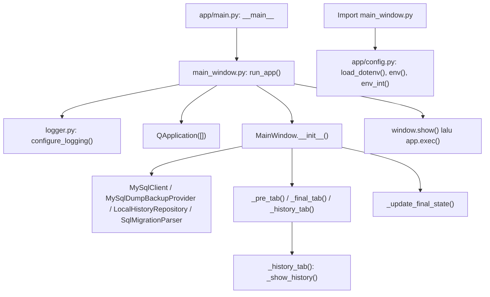
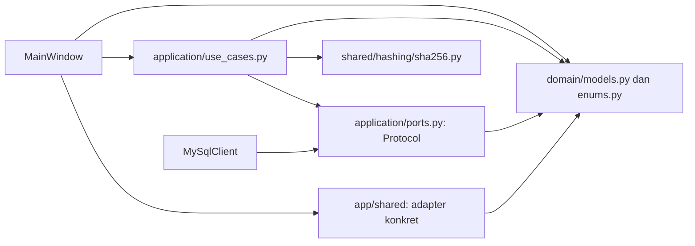
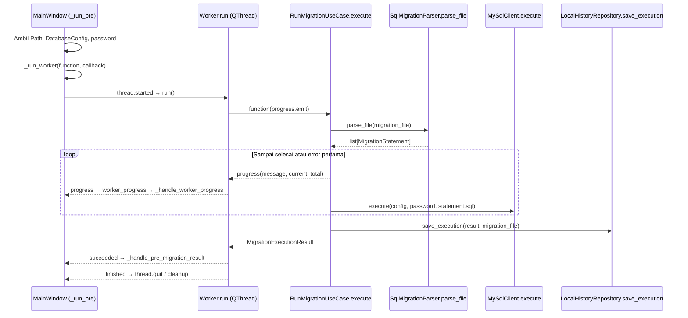

# Arsitektur dan Panduan Pengembangan Khanza Migrator

Dokumen ini berdasarkan pembacaan source repository pada 21 September 2026. Catatan instalasi diperbarui pada Tahap 2 roadmap. Bagian 1–10 menjelaskan implementasi yang ada; bagian 11–13 adalah panduan penambahan fitur; bagian 14 adalah temuan analisis statis; bagian 15–16 adalah usulan struktur yang **belum diimplementasikan**, sedangkan bagian 17 mencatat roadmap dan tahap yang sudah dikerjakan. Semua path relatif terhadap root repository.

Analisis awal tidak menjalankan GUI, koneksi database, migration, atau backup. Verifikasi Tahap 2 dibatasi pada instalasi, baseline test, import, dan startup Qt offscreen terisolasi tanpa operasi database. Perilaku runtime lainnya yang belum diverifikasi tetap disebut sebagai risiko. Source aplikasi tidak diubah.

## 1. Overview

Khanza Migrator merupakan aplikasi desktop PySide6 untuk mencoba SQL migration pada database TEST, menyimpan approval, membuat backup PRODUCTION, lalu menjalankan migration final. Aplikasi menerima SQL dari luar; tidak menghasilkan migration SQL.

Arsitektur existing memisahkan model domain, use case, dan UI, dengan adapter teknis di `app/shared/`. Pemisahan belum menyeluruh: `MainWindow` juga merakit dependensi, membaca filesystem, mengelola state lintas tab, dan mengatur thread.

Urutan baca yang disarankan:

1. `app/main.py` → `run_app()` dan `MainWindow.__init__()` di `app/presentation/qt/migration/main_window.py`.
2. `MainWindow._pre_tab()` → `_run_pre()` → `_run_worker()`.
3. `Worker.run()` di `app/presentation/qt/migration/workers.py`.
4. `RunMigrationUseCase.execute()` di `app/domains/migration/application/use_cases.py`.
5. Kontrak di `app/domains/migration/application/ports.py`, model di `app/domains/migration/domain/models.py`, lalu adapter di `app/shared/`.

Tidak ditemukan class `MigrationService`, class tab tersendiri, custom `QDialog`, registry tab, atau dependency injection framework. Unit orchestration aplikasi saat ini adalah class `*UseCase` dengan method `execute()`.

## 2. Application Entry Point

| Jalur | File/simbol | Perilaku |
| --- | --- | --- |
| GUI: `python -m app.main` | `app/main.py`, blok `if __name__ == "__main__"` | Memanggil `run_app()` yang diimpor dari module UI |
| CLI: `python -m app.cli` | `app/cli.py`, `main()` | `argparse` memilih subcommand `hash` atau `parse`; keluar melalui `SystemExit(main())` |
| CLI setelah instalasi package | `pyproject.toml`, `[project.scripts]` | `khanza-migrator = "app.cli:main"`; command ini bukan launcher GUI |

`app/cli.py:main()` langsung menggunakan `sha256_file()` atau `SqlMigrationParser.parse_file()`. CLI tidak membuat `MainWindow`, tidak mengimpor konfigurasi GUI, dan belum menyediakan reset, approval, backup, atau eksekusi migration.

Dependensi yang ditemukan:

- `pyproject.toml` adalah sumber acuan runtime dependency: `PySide6>=6.7,<7` dan `python-dotenv>=1.2,<2`. `app/config.py` mengimpor `dotenv.load_dotenv`; dependency ini sudah dideklarasikan pada Tahap 2.
- `requirements.txt` merujuk ke package lokal (`.`), sehingga `python -m pip install -r requirements.txt` dari root repository menggunakan metadata yang sama dengan `python -m pip install .`.
- `app/shared/database/mysql_client.py:MySqlClient` menjalankan executable `mysql`; `app/shared/database/backup.py:MySqlDumpBackupProvider` menjalankan `mysqldump`. Tidak ditemukan driver koneksi Python atau ORM.
- Minimum Python ditetapkan pada `project.requires-python = ">=3.10"` di `pyproject.toml`; README dan AGENTS merujuk ke sana. Source menggunakan union type `X | None` (Python 3.10), tidak ditemukan API khusus 3.11. Metadata dependency yang diperiksa mendukung 3.10: PySide6 6.11.2, python-dotenv 1.2.3, dan pytest 9.1.1. Baseline juga telah dijalankan pada Python 3.10.12. Ini alasan teknis menyesuaikan batas metadata lama `>=3.11`, bukan perubahan behavior source.
- Test menggunakan pytest, termasuk fixture `tmp_path`. Extra `dev` di `pyproject.toml` mendeklarasikan `pytest>=9,<10`, terpisah dari runtime dependency. Instalasi development: `python -m pip install -e '.[dev]'` dari root repository; jalankan `python -m pytest -q`.

## 3. Startup Flow

1. `app/main.py` mengimpor `run_app()` dari `app/presentation/qt/migration/main_window.py`.
2. Import module UI ikut mengimpor `app/config.py`. Pada level module, `load_dotenv(BASE_DIR / ".env")` membaca konfigurasi; `env()` dan `env_int()` membentuk konstanta `PRE_*` dan `FINAL_*`. Parsing port terjadi saat import, sehingga nilai integer yang invalid dapat menggagalkan startup.
3. `run_app()` memanggil `app/shared/logging/logger.py:configure_logging()`: membuat `~/.khanza-migrator/logs/` dan menyiapkan `application.log` serta stream handler.
4. `run_app()` membuat `QApplication([])`, kemudian `MainWindow()`.
5. `MainWindow.__init__()` menghubungkan signal progress, mengatur judul/ukuran, membuat empat adapter, menginisialisasi `last_pre_result`, `last_backup`, dan `_active_threads`.
6. `LocalHistoryRepository.__init__()` membuat direktori history lokal jika belum ada.
7. Ketiga tab dibangun dan didaftarkan secara eager. `_history_tab()` langsung memanggil `_show_history()`.
8. Setelah `setCentralWidget(self.tabs)`, `_update_final_state()` membaca approval, menghitung hash bila sesuai, dan menonaktifkan tombol final execution.
9. `run_app()` memanggil `window.show()` lalu `app.exec()` untuk event loop Qt.



Diagram memisahkan efek import dari pemanggilan `run_app()`. Logging/history memiliki efek tulis ketika aplikasi dijalankan; pemeriksaan startup harus mengarahkannya ke direktori sementara, bukan data pengguna.

## 4. Project Directory Structure

Struktur source yang ditemukan; file `__init__.py` kosong tidak ditampilkan:

```text
app/
├── main.py
├── cli.py
├── config.py
├── domains/
│   └── migration/
│       ├── domain/
│       │   ├── enums.py
│       │   └── models.py
│       └── application/
│           ├── ports.py
│           └── use_cases.py
├── presentation/
│   └── qt/
│       └── migration/
│           ├── main_window.py
│           └── workers.py
└── shared/
    ├── database/
    │   ├── mysql_client.py
    │   └── backup.py
    ├── filesystem/history.py
    ├── hashing/sha256.py
    ├── logging/logger.py
    └── sql/parser.py
tests/
├── conftest.py
├── test_hash.py
├── test_history_repository.py
├── test_migration_use_cases.py
├── test_parser.py
└── test_safety.py
docs/
└── ARCHITECTURE.md
pyproject.toml
requirements.txt
README.md
AGENTS.md
.env.example
```

`app/application/`, `app/infrastructure/`, dan `app/domains/migration/infrastructure/` belum ada. Tree pada README menyebut infrastructure di bawah migration, tetapi adapter aktual berada di `app/shared/`. Arahan layer pada `AGENTS.md` adalah pedoman pengembangan, bukan gambaran persis struktur existing. Worker aktual berada di `app/presentation/qt/migration/workers.py`, sementara pedoman menyarankan `app/presentation/qt/workers/`.

## 5. Layer Responsibilities

| Area                                             | Class/function utama                                               | Tanggung jawab dan dependensi                                                                                                                       |
| ------------------------------------------------ | ------------------------------------------------------------------ | --------------------------------------------------------------------------------------------------------------------------------------------------- |
| `app/domains/migration/domain/`                  | Dataclass pada `models.py`; enum pada `enums.py`                   | Data migration, environment, hasil, approval, backup, safety report. Hanya bergantung pada standard library dan enum lokal; tidak mengimpor PySide6 |
| `app/domains/migration/application/use_cases.py` | Enam class `*UseCase.execute()`                                    | Mengurutkan operasi dan memeriksa prasyarat. Menggunakan model, port, dan helper konkret `sha256_file()`                                            |
| `app/domains/migration/application/ports.py`     | `MigrationParserPort`, `DatabasePort`, `BackupPort`, `HistoryPort` | Kontrak `typing.Protocol` yang dibutuhkan use case; implementasi dapat memenuhi kontrak tanpa mewarisinya                                           |
| `app/shared/database/`                           | `MySqlClient`, `MySqlDumpBackupProvider`                           | Adapter subprocess MySQL dan mysqldump                                                                                                              |
| `app/shared/filesystem/history.py`               | `LocalHistoryRepository`                                           | Menyimpan execution/approval sebagai file lokal                                                                                                     |
| `app/shared/sql/parser.py`                       | `SqlMigrationParser`                                               | Memecah SQL dan menghasilkan model `MigrationStatement`                                                                                             |
| `app/shared/hashing/sha256.py`                   | `sha256_file()`                                                    | Hash file secara chunk                                                                                                                              |
| `app/shared/logging/logger.py`                   | `configure_logging()`                                              | Konfigurasi logging runtime                                                                                                                         |
| `app/presentation/qt/migration/`                 | `MainWindow`, `Worker`                                             | Widget, event handler, pesan, thread dan progress; juga composition/dependency wiring saat ini                                                      |
| `app/config.py`                                  | `env()`, `env_int()`, konstanta                                    | Default input GUI dari environment/.env                                                                                                             |

Nama `shared` tidak berarti seluruh isinya generik: parser, history, database, dan backup mengimpor model migration. `MySqlClient` juga menggunakan `ProgressCallback` dari application port.



Panah menunjukkan ketergantungan kode, bukan inheritance. Domain tidak bergantung balik pada UI atau adapter.

## 6. UI Architecture

Semua UI utama berada pada `app/presentation/qt/migration/main_window.py:MainWindow(QMainWindow)`. `QTabWidget` menjadi central widget. Tampilan disusun dengan Python (`QVBoxLayout`, `QFormLayout`, `QHBoxLayout`); tidak ditemukan file Qt Designer `.ui` dalam source yang ditelusuri.

Widget setiap tab disimpan sebagai atribut `MainWindow`, misalnya `pre_migration`, `pre_database`, `final_migration`, `safety_labels`, dan `history_text`. Handler dapat langsung mengakses widget tab lain. Konversi form ke domain dilakukan oleh `_pre_config()` dan `_final_config()` yang menghasilkan `DatabaseConfig`; password dikirim sebagai argumen terpisah.

State bersama:

| State | Penulis | Pembaca/penggunaan |
| --- | --- | --- |
| `last_pre_result` | `_run_pre()` mereset, `_handle_pre_migration_result()` menyimpan | `_approve()` menggunakan hasil test terakhir |
| `last_backup` | `_backup_finished()` | `_validate_final()` dan `_execute_final()` |
| Approval persisten | `ApproveMigrationUseCase.execute()` → `LocalHistoryRepository.save_approval()` | `_update_final_state()` dan `ValidateFinalMigrationUseCase.execute()` |
| `_active_threads` | `_run_worker()` dan closure `cleanup()` | Menahan referensi pasangan thread/worker selama operasi |

`_browse_file()` menyalin path pre-migration ke field final hanya ketika dialog pemilihan file berhasil dan targetnya `pre_migration`. Mengedit field secara manual tidak memiliki koneksi `textChanged` untuk sinkronisasi/invalidation. Nilai awal `PRE_MIGRATION_FILE` juga tidak langsung mengisi field final yang dibuat kosong.

## 7. Tab Lifecycle

Ketiga tab dibuat sekali pada `MainWindow.__init__()`, dalam urutan berikut:

| Label | Factory di `main_window.py:MainWindow` | Event handler utama |
| --- | --- | --- |
| Pre-Migration | `_pre_tab()` → `QWidget` | `_test_pre_connection()`, `_reset_test()`, `_run_pre()`, `_approve()` |
| Final Migration | `_final_tab()` → `QWidget` | `_validate_final()`, `_create_backup()`, `_execute_final()` |
| History | `_history_tab()` → `QWidget` | `_show_history()` melalui tombol Refresh |

Setiap factory membuat page, layout, widget, menghubungkan `button.clicked.connect(handler)`, lalu mengembalikan page. Registrasi dilakukan eksplisit: `self.tabs.addTab(self._pre_tab(), "Pre-Migration")`, dan pola sama untuk dua tab lainnya.

Tidak ada discovery otomatis, lifecycle `on_enter`, lazy loading, atau handler `currentChanged`. Berpindah tab tidak membuat ulang page dan tidak otomatis merefresh history. `_show_history()` berjalan saat konstruksi History dan saat Refresh diklik. Method ini membaca seluruh path `result.json` melalui `rglob()`, mengurutkannya, lalu menampilkan maksimal 100 entry.

Qt mengelola ownership page melalui widget tree. Kode belum menyediakan pelepasan/cancellation operasi saat menutup tab/window; tidak ditemukan override `closeEvent()`.

## 8. Dialog Lifecycle

Belum ada class dialog buatan sendiri. Semua dialog existing adalah pemanggilan statis `QFileDialog` atau `QMessageBox` di `app/presentation/qt/migration/main_window.py:MainWindow`.

| Pemanggil | Dialog | Hasil dan kelanjutan |
| --- | --- | --- |
| `_browse_file()` | `QFileDialog.getOpenFileName()` | Path nonkosong mengubah field lalu `_update_final_state()`; cancel tidak mengubah field |
| `_test_pre_connection()` | `QMessageBox.warning/question/critical` | Memvalidasi nama, menawarkan create database bila belum ada, atau menampilkan error |
| `_reset_test()` | `QMessageBox.warning()` dengan Yes/No | Konfirmasi default No; hanya Yes memulai reset worker |
| `_run_pre()` | `QMessageBox.warning()` | Menolak file migration yang tidak valid |
| `_approve()` | `QMessageBox.warning/information/critical` | Menolak prasyarat, menampilkan keberhasilan atau exception approval |
| `_validate_final()` | `QMessageBox.critical()` | Exception pre-flight ditampilkan dan method mengembalikan False |
| `_create_backup()` | Warning, `getSaveFileName()`, lalu question overwrite | Path default berada di `~/khanza-migrator-backups/`; cancel/No menghentikan handler |
| `_execute_final()` | `QMessageBox.warning()` Yes/No | Setelah pre-flight lolos, hanya Yes menjalankan final worker |
| `_final_finished()` | `QMessageBox.information/critical` | Menampilkan hasil final |
| `_run_worker()` | `worker.failed` → lambda → `QMessageBox.critical()` | Exception worker dilaporkan dengan judul Operasi gagal |

Pemanggilan dialog meminta hasil sebelum handler melanjutkan. Dialog tidak menjalankan use case sendiri; orchestration tetap di `MainWindow`. Tidak ada dialog password terpisah: password sudah berupa `QLineEdit` dengan echo mode Password, diisi awal dari `app/config.py` bila tersedia.

## 9. Application / Service Flow

### Wiring dan kontrak

`MainWindow.__init__()` membuat adapter; handler membuat use case sesuai kebutuhan. Semua class use case berikut berada di `app/domains/migration/application/use_cases.py` dan memiliki method publik `execute()`.

| Use case | Dependensi constructor | Urutan utama |
| --- | --- | --- |
| `ResetTestDatabaseUseCase` | `DatabasePort` | Wajib TEST dan backup ada → test connection → cek/drop database → create → import → verify |
| `RunMigrationUseCase` | `MigrationParserPort`, `DatabasePort`, `HistoryPort` | Cek file/environment → hash → parse → execute per statement → berhenti pada error pertama → simpan result |
| `ApproveMigrationUseCase` | `HistoryPort` | Hasil wajib SUCCESS dan hash file sama → bentuk `Approval` → simpan |
| `ValidateFinalMigrationUseCase` | `DatabasePort`, `HistoryPort` | Cek file, approval/hash, jumlah hasil pre, environment, koneksi, keberadaan metadata backup → `SafetyReport` |
| `CreateProductionBackupUseCase` | `BackupPort` | Wajib PRODUCTION → hash migration → create backup → verify backup → metadata |
| `RunFinalMigrationUseCase` | `RunMigrationUseCase`, `ValidateFinalMigrationUseCase` | Validasi ulang → `PermissionError` jika gagal → delegasi eksekusi migration |

Tidak semua tombol melewati use case: `_test_pre_connection()` langsung memanggil `MySqlClient.database_exists()`, `create_database()`, dan `test_connection()`. `_show_history()` langsung membaca JSON, tanpa method query pada `HistoryPort`.

### Contoh lengkap: Run Migration pada TEST



`RunMigrationUseCase.execute()` menangkap exception per statement menjadi `StatementResult(success=False)`. Maka signal `Worker.succeeded` berarti function kembali normal, **bukan** seluruh SQL berhasil. Callback UI wajib memeriksa `MigrationExecutionResult.status`. Exception di luar blok eksekusi statement, misalnya parsing atau penyimpanan history, mencapai `Worker.failed`.

Callback aktif untuk pre-migration adalah `_handle_pre_migration_result()`. `_pre_finished()` masih ada, tetapi hanya direferensikan oleh versi `_run_pre()` yang dikomentari; jangan mempelajarinya sebagai jalur aktif. Callback aktif menyimpan hasil dan menampilkan error SQL, tetapi tidak memanggil `_update_final_state()` seperti callback lama.

### Worker dan thread

`app/presentation/qt/migration/workers.py:Worker(QObject)` menerima callable `function`; `run()` memanggil `function(self.progress.emit)`, menerbitkan `succeeded(object)` atau `failed(str)`, dan selalu menerbitkan `finished()`.

`MainWindow._run_worker()` membuat `QThread(self)`, memindahkan worker dengan `moveToThread()`, dan menyimpan pasangan di `_active_threads`. Progress diteruskan melalui signal milik `MainWindow`, lalu diterima `_handle_worker_progress()` yang memiliki dekorator `@Slot` untuk memperbarui log/progress bar. Finish menghubungkan `thread.quit`, `worker.deleteLater`, cleanup referensi, serta `thread.deleteLater`.

`busy_button` hanya digunakan oleh `_create_backup()` untuk menonaktifkan tombol backup selama operasi. Ini bukan pengunci global operasi migration.

Reset, pre-migration, backup, dan eksekusi final memakai worker. Test connection dan pre-flight validation masih sinkron di GUI; approval, hash state, dan pembacaan history juga dilakukan di GUI. Pada `_execute_final()`, lambda worker masih membaca widget secara langsung; lihat bagian 14.

### Adapter dan penyimpanan

- `app/shared/sql/parser.py:SqlMigrationParser.parse_file()` membaca UTF-8 dengan BOM, lalu `parse()` memecah statement dengan dukungan quote, comment dan DELIMITER dasar. `_detect_type()` mengelompokkan SQL; `_description()` mengekstrak deskripsi sederhana. Ini bukan semantic SQL parser.
- `app/shared/database/mysql_client.py:MySqlClient.execute()` membuat proses `mysql --execute` baru untuk **setiap** statement. Tidak ada sesi/koneksi bersama antarstatement, sehingga state seperti session variable atau temporary table tidak boleh diasumsikan bertahan.
- `MySqlClient.import_sql()` mengirim file langsung ke stdin satu proses mysql, menunggu proses selesai, dan menggunakan temporary file untuk stderr. Progress import berupa mulai/selesai, bukan persentase byte. `verify_database()` menguji koneksi dan jumlah tabel lebih dari nol.
- `app/shared/database/backup.py:MySqlDumpBackupProvider.create_backup()` menjalankan mysqldump dengan routines/triggers/events dan `--databases`, menghasilkan `BackupMetadata`. `verify_backup()` memeriksa keberadaan, ukuran, dan SHA-256; tidak melakukan uji restore.
- Kedua adapter database mengirim password lewat environment `MYSQL_PWD` pada child process, bukan argumen command line.
- `app/shared/filesystem/history.py:LocalHistoryRepository.save_execution()` menyimpan `migration.sql`, `result.json`, dan `metadata.json` di `~/.khanza-migrator/history/<tahun>/<bulan>/migration_<timestamp>/`. `save_approval()` menyimpan satu approval di `~/.khanza-migrator/approval.json`; approval berikutnya menggantikannya.
- `save_execution()` menerima parameter opsional `backup`, tetapi `RunMigrationUseCase.execute()` tidak mengirimkannya, termasuk saat dipanggil dari final use case. Karena itu metadata execution dari alur ini menyimpan `backup: null`.

Tidak ada automatic rollback/restore di `RunMigrationUseCase` atau `RunFinalMigrationUseCase`. Eksekusi berhenti pada statement pertama yang gagal; statement sebelumnya mungkin sudah mengubah database.

## 10. Domain Layer

Semua model berikut berada di `app/domains/migration/domain/models.py`:

| Model | Peran |
| --- | --- |
| `DatabaseConfig` | Host, port, database, username, `Environment`; password tidak disimpan di model |
| `MigrationStatement` | Nomor urut, SQL, `StatementType`, deskripsi |
| `StatementResult` | Keberhasilan, durasi, SQL, error code/message satu statement |
| `MigrationExecutionResult` | Status, hash, target database, waktu, hasil statement; property `success_count`, `failed_count`, `failed_statement` |
| `Approval` | Nama/hash migration, informasi test, jumlah hasil, waktu approval, versi aplikasi |
| `BackupMetadata` | Target host/database, path/ukuran/hash backup, hash migration, waktu dan versi |
| `SafetyCheck` | Nama, hasil boolean, detail satu pemeriksaan |
| `SafetyReport` | List check; property `passed` menghitung `all(check.passed)` |

`app/domains/migration/domain/enums.py` mendefinisikan `Environment`, `MigrationStatus`, dan `StatementType`. Tidak ada class state machine. Banyak nilai `MigrationStatus` disediakan, tetapi execution aktual menghasilkan SUCCESS/FAILED; teks UI seperti FINAL MIGRATION COMPLETED tidak otomatis berarti hasil persisten menggunakan enum COMPLETED.

Model sebagian besar merupakan dataclass pembawa data. Validasi TEST/PRODUCTION, hash approval, dan prasyarat final berada di use case. Ini cukup wajar untuk ukuran aplikasi saat ini; tidak perlu memindahkan semua aturan ke domain hanya untuk mengikuti pola tertentu.

## 11. How to Add a New Tab

Panduan ini belum diterapkan. Contoh nama `InspectionTab` adalah ilustrasi komponen baru, bukan class existing.

1. Buat `app/presentation/qt/migration/tabs/inspection_tab.py` berisi `InspectionTab(QWidget)` dengan `__init__()` untuk layout dan signal. Tambahkan package `tabs/__init__.py` bila mengikuti konvensi package repository.
2. Berikan dependensi yang benar-benar dibutuhkan melalui constructor, misalnya use case inspeksi. Simpan widget milik tab pada class tersebut. Jangan memberikan seluruh `MainWindow` sebagai tempat mengambil semua state/dependensi.
3. Ubah `app/presentation/qt/migration/main_window.py:MainWindow.__init__()` untuk import, membuat instance, dan memanggil `self.tabs.addTab(inspection_tab, "Inspection")`. Ini satu-satunya titik registrasi existing; tidak perlu registry/plugin framework.
4. Hubungkan tombol ke handler class tab, misalnya `InspectionTab._inspect()`. Handler mengambil input widget di GUI thread, membentuk parameter biasa/dataclass, lalu memanggil use case melalui worker jika operasi lama.
5. Untuk integrasi awal tanpa refactor global, `MainWindow` dapat menerima signal permintaan dari tab dan menjadi penghubung ke `_run_worker()`. Hasil diteruskan ke method tab seperti `show_result()`. Jangan menganggap shared `TaskRunner` sudah tersedia; itu usulan bagian 15.
6. Jika tab memengaruhi final migration, kirim signal berisi data yang dibutuhkan dan buat invalidation state eksplisit. Hindari mengubah widget final langsung dari class tab baru.

Alur tambahan yang disarankan: `MainWindow.__init__()` → `InspectionTab.__init__()` → tombol → `_inspect()` → worker/use case → hasil → `show_result()`. Untuk tab presentasi murni, domain/application baru tidak diperlukan. Pola existing berupa `_nama_tab()` dapat diikuti untuk perubahan sangat kecil, tetapi terus memperbesar `MainWindow` akan menambah masalah yang sudah ada.

## 12. How to Add a New Dialog

Untuk konfirmasi sederhana, gunakan pola existing `QMessageBox` pada handler pemanggil. Untuk form atau dialog kompleks:

1. Buat `app/presentation/qt/migration/dialogs/connection_dialog.py` dan package `dialogs/__init__.py`, dengan class usulan `ConnectionDialog(QDialog)`.
2. `ConnectionDialog.__init__()` menyusun field dan tombol. Hubungkan aksi OK/Cancel ke `accept()`/`reject()`. Jika input belum valid, tampilkan masalah input dan jangan accept dulu.
3. Sediakan method seperti `database_config() -> DatabaseConfig`; password tetap terpisah, sesuai kontrak existing. Dialog bertanggung jawab atas input/presentasi, bukan menjalankan subprocess database.
4. Ubah handler pemanggil pada `main_window.py:MainWindow` atau class tab baru untuk membuat dialog dengan parent, memanggil `exec()`, memeriksa `QDialog.DialogCode.Accepted`, lalu mengambil data.
5. Setelah accepted, handler menjalankan use case/worker. Cancel menghentikan alur tanpa operasi database. Jika dialog memang harus menampilkan operasi asinkron, gunakan signal/slot dan kepemilikan worker yang jelas.

Alur usulan: handler UI → `ConnectionDialog.exec()` → `accept()` → `database_config()` → use case. Class dan path ini belum ada. Domain/application tetap tidak boleh mengimpor `QDialog`, `QMessageBox`, atau widget lain.

## 13. How to Add a New Feature

Contoh fitur kecil: preview statement tanpa eksekusi database.

| Kebutuhan | File/class yang mungkin dibuat atau diubah | Alur |
| --- | --- | --- |
| Orchestration preview | File baru `app/domains/migration/application/preview_migration.py`, class usulan `PreviewMigrationUseCase.execute(path)` | Gunakan `MigrationParserPort.parse_file()` dan kembalikan `list[MigrationStatement]`; tidak perlu DTO/port baru jika kontrak existing cukup |
| Tampilan preview | Class tab/dialog baru di `app/presentation/qt/migration/` | Ambil path → use case di worker untuk file besar → render hasil |
| Wiring | `main_window.py:MainWindow.__init__()`/handler | Suntikkan `SqlMigrationParser` existing; kelak pindah ke bootstrap yang diusulkan |
| Test fitur | Misalnya `tests/test_preview_migration.py` | Fake parser untuk membuktikan hasil/error tanpa Qt atau database |

Untuk logic migration lain:

1. Definisikan aturan dan input/output terlebih dahulu. Perhitungan murni dapat menjadi function kecil di `app/domains/migration/domain/`; orchestration I/O berada di application.
2. Gunakan/tambahkan dataclass di `domain/models.py` atau file domain khusus jika konsepnya cukup besar. Jangan memasukkan format widget ke model.
3. Tambah use case terfokus; tidak perlu menaruh semua class selamanya di `application/use_cases.py`.
4. Jika memerlukan kemampuan eksternal yang belum ada, tambahkan kontrak spesifik di `application/ports.py`, lalu adapter. Saat mengikuti lokasi existing, adapter ada di `app/shared/`; tujuan yang disarankan setelah penataan adalah `app/infrastructure/`.
5. Hubungkan adapter → use case → handler UI. Gunakan callable progress existing `ProgressCallback = Callable[[str, int, int], None]` bila cukup; application tidak perlu mengenal Qt signal.
6. Ambil semua nilai widget sebelum membuat function worker. Tangani hasil normal yang menyatakan kegagalan bisnis dan exception secara berbeda.
7. Uji aturan di luar Qt dengan fake port. Pengujian adapter subprocess harus terisolasi atau memakai database disposable, bukan database operasional.

Untuk fitur yang benar-benar merupakan domain berbeda, baru pertimbangkan package `app/domains/<fitur>/`. Jangan membuat domain baru hanya karena ada tab baru. Tidak perlu base service, base repository, event bus, atau dependency injection container untuk setiap penambahan.

## 14. Current Architecture Problems

Temuan berikut dibedakan antara fakta kode dan dampak/risiko yang disimpulkan. Ini bukan daftar perubahan yang telah dilakukan.

| Temuan dan lokasi | Bukti existing | Dampak saat dikembangkan |
| --- | --- | --- |
| `MainWindow` terlalu banyak responsibility — `app/presentation/qt/migration/main_window.py` | Sekitar 788 baris mencakup layout tiga tab, wiring adapter/use case, state, JSON history, dialogs, dan thread | Penambahan tab/fitur menyentuh class yang sama; pengujian UI dan orchestration sulit dipisahkan |
| Akses widget dari worker — `MainWindow._execute_final()` | Lambda yang dieksekusi `Worker.run()` memanggil `final_migration.text()`, `_final_config()`, dan `final_password.text()` serta membaca `last_backup` | Akses QWidget di luar GUI thread dan input yang tidak diambil sebagai snapshot; pola reset/pre/backup sudah mengambil input sebelum worker |
| I/O sinkron di GUI — `_test_pre_connection()`, `_validate_final()`, `_approve()`, `_update_final_state()`, `_show_history()` | Pemanggilan subprocess, hash, atau filesystem langsung dari handler/konstruksi UI | UI berpotensi macet pada koneksi lambat atau file besar; backend tidak memiliki timeout subprocess eksplisit |
| State tidak terikat pada input — `_browse_file()`, `_backup_finished()`, `_validate_final()` | Tidak ada signal perubahan input yang mereset `last_backup`; edit host/database/path tidak menghapus metadata backup lama | Backup sebelumnya dapat tetap dianggap tersedia setelah target berubah |
| Gate backup terlalu lemah — `use_cases.py:ValidateFinalMigrationUseCase.execute()` | `backup_ok = backup is not None`; tidak mencocokkan host/database/hash migration atau memanggil `verify_backup()` lagi | Metadata lama atau file yang berubah setelah backup tidak ditolak oleh check ini. Verifikasi ukuran/hash hanya dilakukan saat pembuatan backup |
| Validasi readable dan approval terbatas — `ValidateFinalMigrationUseCase.execute()` | Readable berarti `is_file()` dan ukuran `>= 0`; approval valid berdasarkan keberadaan, hash, dan count | Label readable tidak membuktikan file bisa dibaca; hashing tetap bisa melempar exception. Belum ada provenance environment pada hasil execution |
| Approval tidak menjamin asal TEST pada boundary — `ApproveMigrationUseCase.execute()` dan `models.py:MigrationExecutionResult` | Hanya status/hash yang diperiksa; hasil tidak membawa environment. `RunMigrationUseCase` sendiri menerima TEST maupun PRODUCTION | GUI normal menggunakan hasil pre, tetapi pemanggil baru harus berhati-hati; kontrak belum menegakkan asal test secara mandiri |
| Operasi paralel/shutdown belum dikoordinasikan — `MainWindow._run_worker()` | Hanya tombol backup mendapat busy guard; tidak ada `closeEvent()` atau cancellation | Klik berulang/reset bersamaan dan penutupan window saat worker aktif perlu kebijakan eksplisit |
| Sebagian koneksi callback thread masih berupa lambda/closure — `_run_worker()` | Progress memakai slot `MainWindow`, sedangkan error dan cleanup menggunakan callable biasa | Konteks eksekusi callback UI perlu diuji pada PySide6 yang digunakan; dokumentasi ini tidak mengklaim telah memverifikasi thread callback tersebut |
| History melewati boundary — `_show_history()` dan `HistoryPort` | UI mengetahui `history.root`, glob dan format JSON; port tidak menyediakan query | Mengganti format/backend history memerlukan perubahan UI; JSON invalid dilewati tanpa penjelasan |
| Metadata backup tidak masuk history final — `RunFinalMigrationUseCase.execute()` → `RunMigrationUseCase.execute()` | Parameter backup berhenti di validasi; `save_execution()` dipanggil tanpa backup | Audit execution tidak memiliki referensi backup walaupun repository mendukungnya |
| Granularitas history/approval — `LocalHistoryRepository` | Nama folder memakai timestamp sampai detik, satu file approval global | Eksekusi dalam detik yang sama berpotensi menulis folder sama; multi-migration/multi-target akan memerlukan identitas lebih jelas |
| Model eksekusi per statement — `MySqlClient.execute()` | Proses mysql baru untuk setiap statement | Session SQL tidak bertahan; perubahan menuju koneksi persisten merupakan perubahan semantik, bukan sekadar refactor |
| Reset/import tidak memeriksa isi dump — `ResetTestDatabaseUseCase.execute()` dan `MySqlClient.import_sql()` | Gate memeriksa label TEST, tetapi file SQL langsung diberikan ke mysql. Backup provider menghasilkan dump dengan `--databases` | Jika dump berisi `USE`/DDL database, database aktif dapat ditentukan isi SQL; label TEST saja tidak membuktikan seluruh perintah dibatasi ke target test. Belum diuji secara runtime |
| Validasi form tersebar — `_pre_config()`, `_final_config()` | `int(port_text)` dilakukan langsung; beberapa handler memanggilnya di luar try | Input invalid dapat keluar dari handler tanpa pesan validasi yang seragam |
| Data hasil dan state kurang tegas — `RunMigrationUseCase`, `MigrationStatus` | Nol statement dapat menghasilkan SUCCESS; pre-flight kemudian mensyaratkan `success_count > 0`; enum tidak membentuk state machine | Pemanggil baru perlu memahami perbedaan sukses eksekusi, approval, dan kesiapan final |
| Sisa kode dan logging — `_pre_finished()`, komentar implementasi lama, `Worker.run()`, reset use case, `MySqlClient.import_sql()` | Ada jalur lama yang tidak dipakai dan banyak `print()` meskipun logger dikonfigurasi | Pembaca mudah mengikuti alur salah; print tidak otomatis masuk file logging |
| Struktur/dependensi tidak konsisten (sebagian selesai pada Tahap 2) | `README.md`, `AGENTS.md`, `app/config.py`, `pyproject.toml` | Dependency runtime/dev dan minimum Python sudah diselaraskan. Perbedaan tree infrastructure belum ditangani karena termasuk pekerjaan struktur berikutnya |

README juga menyebut connection profile disimpan tanpa password. Tidak ditemukan implementasi penyimpanan profile tersebut; yang ditemukan adalah field GUI yang diinisialisasi dari environment/.env. Dokumen ini tidak mengasumsikan profile manager atau password prompt yang belum ada.

Tahap 1 menambahkan baseline pada `tests/conftest.py`, `tests/test_migration_use_cases.py`, dan `tests/test_history_repository.py`, melengkapi test hash/parser/safety existing: 57 kasus lolos. Cakupan meliputi run migration, approval, final gate/orchestration, dan persistence. Test lifecycle worker, UI, serta integrasi MySQL belum tersedia.

## 15. Recommended Refactor

Rekomendasi mempertahankan pendekatan sederhana: widget terpisah, use case kecil, constructor injection, dan port yang sudah ada. Tidak diperlukan DDD penuh atau framework baru.

1. **Pisahkan startup dan wiring.** Tambahkan `app/bootstrap.py:create_main_window()` untuk membuat adapter/use case dan memasukkannya ke UI. Pindahkan `run_app()` ke `app/presentation/qt/app.py`. `app/main.py` tetap entry GUI yang tipis. Objek dependensi kecil boleh memakai dataclass; tidak perlu container global.
2. **Ekstrak tab satu per satu.** Pindahkan layout/handler milik tab ke `PreMigrationTab`, `FinalMigrationTab`, dan `HistoryTab`. `MainWindow` mengatur registrasi serta hubungan antar-tab. Gunakan signal data untuk hasil approval/input berubah, bukan akses widget silang.
3. **Pisahkan eksekusi background.** Tempatkan `Worker` dan class kecil `TaskRunner` di `app/presentation/qt/workers/`. Runner mengelola lifecycle QThread, result/error/progress, busy state dan shutdown. Ia tetap komponen presentasi, bukan service domain.
4. **Buat boundary history query.** Tambahkan use case pembacaan history dengan method repository yang mengembalikan data terstruktur. `HistoryTab` cukup menampilkan hasil; tidak tahu struktur JSON/direktori.
5. **Kelompokkan adapter di infrastructure.** Pindahkan adapter database, parser, dan repository ke `app/infrastructure/`; pertahankan `shared` hanya untuk utilitas yang benar-benar umum seperti hash/logging. Jangan sekaligus mengganti backend.
6. **Pecah use case jika membantu navigasi.** Satu file per operasi memudahkan belajar tanpa mengubah kontrak. Pertahankan application migration di bawah domain package untuk tahap awal. `app/application/` baru diperlukan bila ada orchestration lintas domain; folder kosong belum memberi manfaat.
7. **Pisahkan penguatan behavior dari refactor.** Perbaikan gate backup, invalidation state, asal TEST, concurrency, import dump, dan metadata history harus mempunyai spesifikasi/test sendiri. Perubahan ini tidak boleh disamarkan sebagai pemindahan file yang menjaga behavior.
8. **Rapikan kontrak dan konfigurasi.** Tambahkan type hint pada handler/worker callback yang relevan, gunakan DTO hanya bila data mulai tersebar, dan buat loading konfigurasi eksplisit bila perlu. Selaraskan dependency/version/documentation melalui perubahan tersendiri.

Dialog existing yang sederhana tetap layak memakai `QMessageBox`/`QFileDialog`. Buat class dialog hanya ketika ada form atau logic presentasi yang cukup kompleks. Jangan membuat class abstrak tab/dialog semata-mata untuk menyamakan bentuknya.

## 16. Proposed Directory Structure

Tree berikut adalah target bertahap, **bukan keadaan repository sekarang**. `__init__.py` tidak ditampilkan. Bagian application migration tetap di lokasi konsep existing untuk mengurangi perpindahan yang tidak perlu.

```text
app/
├── main.py                         # Entry GUI
├── cli.py                          # Entry CLI hash/parse
├── bootstrap.py                    # create_main_window(): wiring konkret
├── config.py                       # Loading konfigurasi aplikasi
├── domains/
│   └── migration/
│       ├── domain/
│       │   ├── models.py            # Dataclass dan hasil operasi
│       │   └── enums.py             # Environment/status/jenis statement
│       └── application/
│           ├── ports.py            # Kontrak I/O sesuai kebutuhan use case
│           ├── reset_test_database.py
│           ├── run_migration.py
│           ├── approve_migration.py
│           ├── validate_final_migration.py
│           ├── create_production_backup.py
│           ├── run_final_migration.py
│           └── list_history.py     # Query history terstruktur
├── infrastructure/
│   ├── database/
│   │   ├── mysql_client.py          # Adapter DatabasePort
│   │   └── backup.py                # Adapter BackupPort
│   ├── filesystem/
│   │   └── history.py               # Adapter history lokal
│   └── sql/
│       └── parser.py                # Adapter MigrationParserPort
├── presentation/
│   └── qt/
│       ├── app.py                  # run_app(): QApplication/event loop
│       ├── workers/
│       │   ├── worker.py           # Worker: eksekusi callable dan signal
│       │   └── task_runner.py      # TaskRunner: ownership/lifecycle thread
│       └── migration/
│           ├── main_window.py      # Shell dan koordinasi antar-tab
│           ├── tabs/
│           │   ├── pre_migration_tab.py
│           │   ├── final_migration_tab.py
│           │   └── history_tab.py
│           ├── dialogs/            # Hanya dibuat saat ada dialog kompleks
│           │   └── connection_dialog.py  # Contoh opsional, bukan kebutuhan wajib
│           └── widgets/
│               └── database_form.py      # Form koneksi jika duplikasi layak diekstrak
└── shared/
    ├── hashing/sha256.py            # Utility tanpa pengetahuan migration
    └── logging/logger.py           # Setup logging teknis
tests/
├── test_hash.py
├── test_parser.py
├── test_safety.py
├── application/                    # Use case dengan fake port
├── infrastructure/                 # Kontrak adapter terisolasi
└── presentation/                   # Signal, state UI, lifecycle worker
docs/
└── ARCHITECTURE.md
```

`bootstrap.py` menjadi tempat yang mengenal adapter konkret dan UI sekaligus. `domains/migration/application` tetap mengatur workflow tanpa Qt; `infrastructure` menangani I/O; `presentation` menerjemahkan input/output pengguna; `shared` menampung utility umum. Bila kelak ada workflow lintas domain, `app/application/` dapat ditambahkan khusus untuk itu. Tidak perlu menduplikasi use case migration di dua tempat.

`DatabaseForm` bersifat opsional: ia hanya mengelola field dan validasi input, bukan menetapkan safety policy TEST/PRODUCTION atau menjalankan query. `TaskRunner` juga tidak boleh menjadi tempat semua business logic dipindahkan dari `MainWindow`.

## 17. Refactor Roadmap

Tahap 1 (baseline) sudah selesai. Tahap 2 menyelaraskan dependency runtime/dev dan minimum Python tanpa mengubah source aplikasi. Tahap 3 dan seterusnya masih berupa rekomendasi, belum dijalankan.

Verifikasi Tahap 2 (22 September 2026): instalasi package dengan extra `dev` dalam
virtual environment baru di `/tmp` berhasil pada Python 3.10.12; seluruh suite
menghasilkan **57 passed, 0 failed**, dan `pip check` tidak menemukan konflik.
Seluruh module aplikasi dari package terinstal dapat diimpor. Entry CLI
`khanza-migrator --help` dan `python -m app.cli --help` berhasil. `run_app()`
diperiksa memakai Qt offscreen: tiga tab terbentuk, event loop berjalan lalu
ditutup otomatis, tidak ada worker aktif atau pemanggilan subprocess. Lokasi
home untuk history/log diarahkan ke direktori sementara melalui test harness.
Pemeriksaan ini bukan pengujian interaksi GUI lengkap atau integrasi MySQL.

| Tahap | Perubahan kecil | Cara memastikan aman |
| --- | --- | --- |
| 1. Tetapkan baseline | Dokumentasikan urutan operasi dan kontrak hasil dari use case existing; tambahkan test terfokus untuk stop-on-first-error, approval/hash, final gate, dan persistensi | Gunakan fake parser/database/history; catat behavior existing termasuk keterbatasan, tanpa koneksi production |
| 2. Selaraskan instalasi | Deklarasikan dependency yang memang diimpor, sepakati minimum Python, perbarui README | Cek import/startup dalam environment uji terisolasi; pisahkan dari perubahan workflow |
| 3. Ekstrak composition | Tambahkan bootstrap; pindahkan pembuatan adapter keluar `MainWindow` tanpa mengubah instance/metode yang dipakai | Bandingkan dependensi yang diinjeksi dan smoke-test startup serta CLI |
| 4. Ekstrak History dahulu | Buat `HistoryTab` dengan tampilan/query existing, lalu tambah boundary query dalam perubahan terpisah | Pertahankan urutan, limit 100, format tampilan, dan kebijakan error sampai ada perubahan behavior yang disetujui |
| 5. Ekstrak tab migration | Pindahkan Pre lalu Final satu per satu; hubungkan signal hasil/state eksplisit | Verifikasi tombol, dialog, callback aktif, approval dan status tetap setara |
| 6. Ekstrak worker runner | Pindahkan mekanisme thread ke `presentation/qt/workers/` | Uji progress, hasil FAILED normal vs exception, cleanup, dan ownership; jangan sekaligus mengubah policy operasi |
| 7. Perbaiki thread/state secara eksplisit | Snapshot input final sebelum worker; pindahkan I/O lama dari GUI; tentukan busy guard dan shutdown | Uji interaksi selama operasi, pembatalan/penutupan, dan callback selalu memperbarui UI di GUI thread |
| 8. Rapikan lokasi adapter/use case | Pindahkan adapter ke infrastructure dan pecah file use case bila perlu; perbarui seluruh import termasuk CLI/test/bootstrap | Jalankan test existing dan cek import; perubahan ini tidak mengganti format file, command SQL, atau algoritma parser |
| 9. Perkuat kontrak safety dan audit | Cocokkan backup dengan target/hash, verifikasi ulang file, invalidasi state, pastikan asal TEST, simpan referensi backup; evaluasi isi dump sebelum reset/import | Tambah test per aturan; uji integrasi hanya di database disposable. Perlakukan sebagai perubahan behavior terpisah |
| 10. Bersihkan sisa kode | Hapus jalur komentar/usang setelah pemanggil dipastikan, seragamkan logging/type hints, perbarui panduan | Pastikan callback aktif tidak berubah; review diff kecil dan jalankan pemeriksaan yang relevan |

Perubahan backend koneksi agar session SQL bertahan, cancellation subprocess, dan model multi-approval memerlukan keputusan fitur tersendiri; jangan digabungkan ke refactor struktur. Setiap tahap sebaiknya dapat direview dan dibatalkan terpisah. Dokumentasi awal tidak mengubah source; pembaruan Tahap 1 hanya menambahkan test dan Tahap 2 hanya menyelaraskan metadata instalasi serta dokumentasi.
